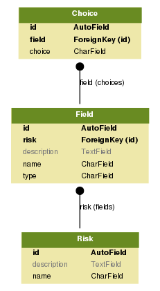
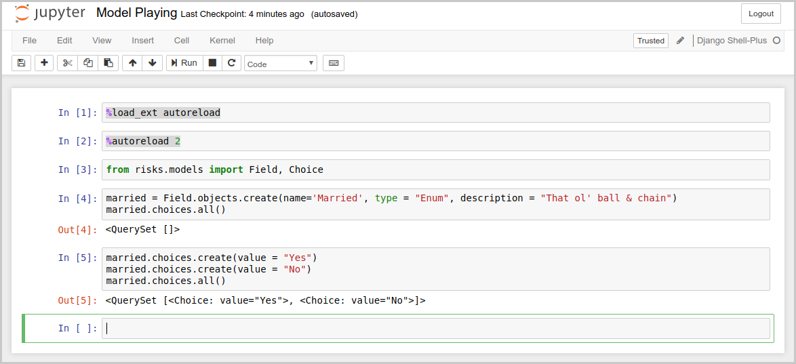

# Risk Model Builder

## Overview

The purpose of this app is to showcase my Python skills, specifically the ones related to web development. The app is composed of the following components:

* Risk Model API: A RESTful service implemented with Django REST Framework.

* Risk Model UI: A Single Page application developed with Vue.js.

### Dependencies

This app has been developed with Python 3.5.2.

The following are required for development with Django and Django REST Framework:

    sudo pip install django
    sudo pip install djangorestframework

The following is for coverage reports (which we will detail in the 'Running Tests' section):

    sudo pip install django-nose

## Running Tests

To run the test suite:

    python manage.py test

Which should output something similar to the following:

    nosetests --with-coverage --cover-package=risks --cover-erase --cover-html --cover-html-dir=reports --verbosity=1
    Creating test database for alias 'default'...
    .......
    Name                               Stmts   Miss  Cover
    ------------------------------------------------------
    risks/__init__.py                      0      0   100%
    risks/admin.py                         1      1     0%
    risks/migrations/0001_initial.py       6      0   100%
    risks/migrations/__init__.py           0      0   100%
    risks/models.py                       16     16     0%
    risks/serializers.py                  22      0   100%
    risks/views.py                        33      0   100%
    ------------------------------------------------------
    TOTAL                                 78     17    78%
    ----------------------------------------------------------------------
    Ran 7 tests in 0.164s
     
    OK
    Destroying test database for alias 'default'...

By the way, you will also find HTML reports [here](risk_model_api/reports/index.html), these are nicer, as they highlight the lines of code not covered by tests.

Note that the coverage for `risks/models.py` says "0%", that's because of an [issue with django-nose](https://github.com/django-nose/django-nose/issues/180). Although I have chosen to not write tests for the models in isolation, the models are being tested indirectly through the view tests.

For the untrained eye, not writing such tests might seem like laziness, but that's not the case at all. As TDD developers, we should test behavior, not functions. Ian Cooper explains this better than I could here: [TDD, where all went wrong](https://vimeo.com/68375232), as well as Uncle Bob here: [Giving Up on TDD](http://blog.cleancoder.com/uncle-bob/2016/03/19/GivingUpOnTDD.html).

I used to work for AOL and they used number of tests written (not test coverage unfortunately) as a metric to evaluate the teams, thus everyone would write as many tests as possible. In fact, they write too many tests. Every method in every class had at least a couple of tests. This make the production code insanely coupled to the test code. Several times I had to rewrite and throw away dozens and dozens of tests because of simple refactorings.

And still, even though the code had good coverage (at least in the reports), most poeple would neglect to test behavior (e.g., they can figure out how to simulate a given call to a soap end-point or how to mock it in a higher level, so they would neglect to write any behavior that depended on it).

## ER Diagram

The ER diagram above has been generated from the app's models with [django-graphviz](https://code.google.com/archive/p/django-graphviz/).

To install it in your system run the following commands:

    sudo pip install pydotplus

The following command will generate the diagram above:

    python manage.py graph_models risks -o ../images/risk_er_diagram.png

Another option would be generating the app's models from the diagram (which could be created using [ArgoUML](http://argouml.tigris.org/) for instance) using [uml-to-django](https://code.google.com/archive/p/uml-to-django/). I don't particularly like this option given that the generated code might not be compliant with the latest Django specs.

Note that there is a separated entity for choices, which in principle could be an array. In fact Django makes available [`ArrayField`](https://docs.djangoproject.com/en/2.0/ref/contrib/postgres/fields/#arrayfield). Unfortunately, `ArrayField` can only be used with Postgres databases and for this reason I opted for a separated table and a relationship with a foreign key instead.

Django's [validators](https://docs.djangoproject.com/en/2.0/ref/validators/) allows a number of validations on fields and even to relationships between models in a relationship, but given that intermediate records need to be saved before a relationship is created (e.g., a risk type needs to be saved before one can add fields to it), in order to not save data with invalid relationships (a risk type without fields, or a enum field without choices for instance),
I decided to do schema validation instead.

## Schema Validation

The JSON schema for the risk type can be found in [risk_schema.json](./risk_model_api/schemas/risk_schema.json), which defines the properties allowed in the JSON input (for persisting in the database) and the following constraints:

* Only fields of type 'enum' may have choices.

* Fields of type 'enum' shall have at least two choices.

## Developer's Guide

For my all future reference, I'm going to document the entire process of creating a REST API in Python/Django.

### Creating an App

First you need to create a project, which is comprised of one or more apps:

    django-admin startproject risk_model_api

Then you can add an app to the project:

    python manage.py startapp risks

In our particular case, "risks" is a REST API app.

### Manage Database

#### Migrating

    python manage.py makemigrations risks
    python manage.py migrate risks

You will need to run this command everytime you create or modify a model (in the model-view-controller sense).

#### Cleaning Up

The following command will cleanup the database:

    python manage.py flush

#### Loading Data

The following command will 

    python manage.py loaddata fixtures/test_data.json

Where `test_data.json` is a fixture file with the test data.

### Runnning the App

    python manage.py runserver

This command will run the app, which can be browsed at (this address)[http://localhost:8000/].

### Invoking from the Shell

The standard way to start an interactive session:

    python manage.py shell

But a better way is installing (django-extensions)[https://github.com/django-extensions/django-extensions]:

    sudo pip install django-extensions

You will also need to add 'django-extensions' to `INSTALLED_APPS`.

`shell_plus` will reload the environment for the notebook every time any modifications are applied to the code.

And also iPython and Jupyter:

    sudo pip3 install ipython
    sudo pip3 install jupyter

This way you may run commands in an interactive iPython Jupyter notebook:

    python manage.py shell_plus --notebook

This will open a web browser window with the Jupyter project tree. Create a notebook by clicking `new > Django Shell-Plus` and type the code you wish to experiment with:

Note `%load_ext autoreload` and `%autoreload 2`: These will reload any modifications in the project source files. 

### Test Coverage

To run test coverage you will to install django-nose:

    sudo pip install django-nose

And add it to your `settings.py`:

    INSTALLED_APPS = [
        
        ...
     
        'django_nose',
    ]
     
    ...
     
    TEST_RUNNER = 'django_nose.NoseTestSuiteRunner'
     
    NOSE_ARGS = [
        '--with-coverage',
        '--cover-package=risks',
    ]

## Sublime Text

Just for future reference, here are some nice plugins for sublime text 3:

* (Sublime Pretty JSON)[https://github.com/dzhibas/SublimePrettyJson]: For formatting JSON.