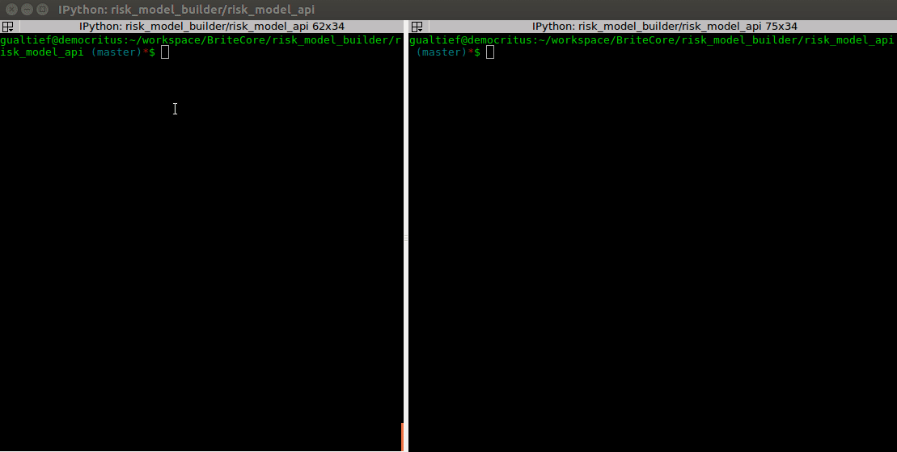
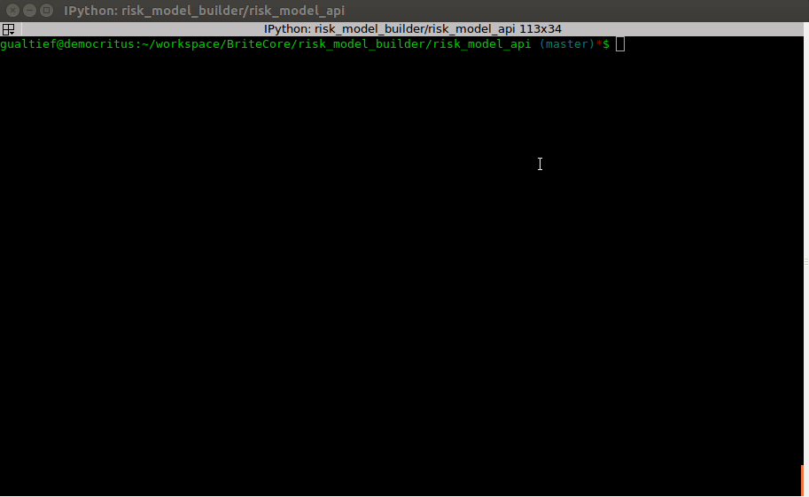
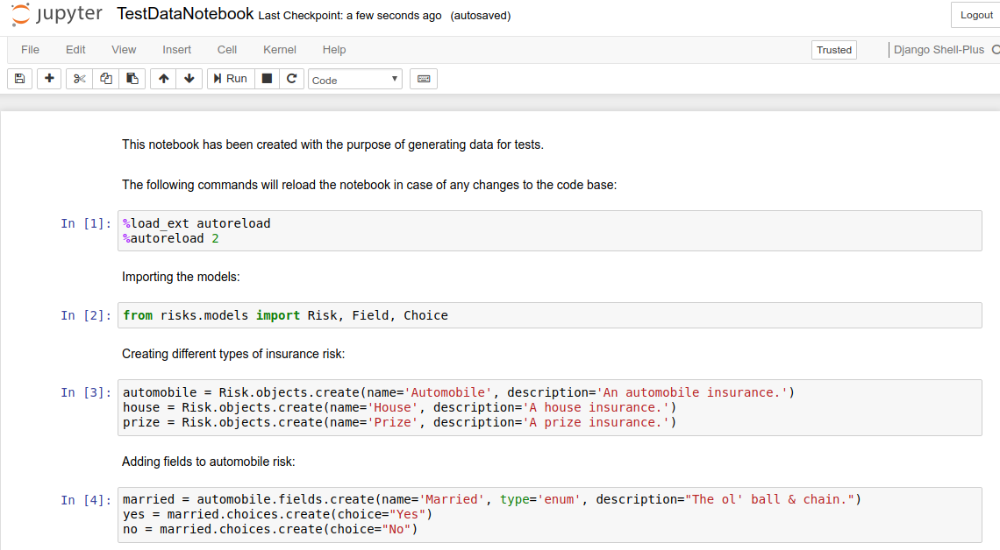

# Risk Model API

## Table of Contents

<!-- MarkdownTOC-->

- Overview
- Demo the App
- ER Diagram
- Schema Validation
- Dependencies
    - Django & Django REST Framework
    - Django Nose
    - Django CORS Headers
    - Django Graphviz
- Running Tests
- Setting-up the Database
- Runnning the App
- Developer's Guide
    - Creating an App
    - Database Management
    - Invoking Commands from the Interactive Shell
    - Test Coverage
    - Deployment to AWS

<!-- /MarkdownTOC -->

## Overview

The purpose of this app is showcasing my web development skills with Python (specifically the [Django REST Framework](http://www.django-rest-framework.org/)).

This app is a back-end service (JSON REST), which stores the definition of risk types. A definition consists of a name, a description and one or more fields. A fields can be a text, a number, a date or an enumeration.

At the moment risk types can be created either by calling the models from the Django API in an interactive shell or by submiting a JSON definition for the risk type through a POST request. There's no UI to create risk types at the moment. The UI only builds application forms from the risk type definitions retrieved from the API.

<kbd></kbd>

## Demo the App

You may demo the API (deployed to Amazon's AWS Lambda with [zappa](https://github.com/Miserlou/Zappa)) using the following links:

* [/risks/](https://yyb8o4lyj9.execute-api.eu-west-1.amazonaws.com/production/risks/) (All Risks)
* [/risks/70](https://yyb8o4lyj9.execute-api.eu-west-1.amazonaws.com/production/risks/70/) (Only Risk with ID 70)

You may also use [curl](https://curl.haxx.se/):

     curl -H 'Accept: application/json; indent=4' https://yyb8o4lyj9.execute-api.eu-west-1.amazonaws.com/production/risks/
     curl -H 'Accept: application/json; indent=4' https://yyb8o4lyj9.execute-api.eu-west-1.amazonaws.com/production/risks/70/

## ER Diagram

<kbd></kbd>

The ER diagram above has been generated from the Django models with [django-graphviz](https://code.google.com/archive/p/django-graphviz/).

Another option would be generating the Django models from the an ER diagram (which could be created using [ArgoUML](http://argouml.tigris.org/)) with [uml-to-django](https://code.google.com/archive/p/uml-to-django/). I don't particularly like this option given that the generated code might not be compliant with the latest Django specs.

Note that there is a separated entity for choices, which in principle could be an array. In fact, Django makes available [`ArrayField`](https://docs.djangoproject.com/en/2.0/ref/contrib/postgres/fields/#arrayfield). Unfortunately, `ArrayField` can only be used with a Postgres database and for this reason I opted for relationships with foreign keys instead.

## Schema Validation

The JSON schema for the risk type can be found in the file [risk_model_api/schemas/risk_schema.json](./risk_model_api/schemas/risk_schema.json), which defines the properties allowed in the JSON input (for persisting in the database using a POST request) and the following constraints:

* Only fields of type 'enum' may have choices.
* Fields of type 'enum' shall have at least two choices.

These constraints will guarantee that we will only persist valid risk types through the API.

We couldn't impose these contraints to the model using Django's [validators](https://docs.djangoproject.com/en/2.0/ref/validators/), given that the data need to be built in steps:

* Create a risk type, save it, get its primary key (which now can used to add fields).
* Add a field to risk, save it, get its primary key (which now can used to add choices).
* Add a choice to field, save it.
* Add another choice to field, save it.

Until the last step is completed, risk type is an invalid record, but we need to save the intermediate steps to get the primary keys to create the relationships.

## Dependencies

This app has been developed with Python 3.6. To install all its dependencies in one step:

    pip install -r requirements.txt 

You may also use the instructions in the sections that follow for details on each one of the project's dependencies.

### Django & Django REST Framework

To install them:

    sudo pip install django
    sudo pip install djangorestframework

### Django Nose

Given that is good practice to generate coverage reports, this projects uses [django-nose](https://github.com/django-nose/django-nose). To install it:

    sudo pip install django-nose

Interactive sessions are also useful, thus the project uses [django-extensions](https://github.com/django-extensions/django-extensions). To install it:

    sudo pip install django-extensions

### Django CORS Headers

We need to add CORS (Cross-Origin Resource Sharing) headers to responses so the UI can access the REST resources. Luckyly there's a Django module for that: [django-cors-headers](https://github.com/ottoyiu/django-cors-headers).

    sudo pip install django-cors-headers

You will also need add the following configuration to `settings.py`:

    INSTALLED_APPS = (
        ...
        'corsheaders',
        ...
    )
     
    MIDDLEWARE = [  # Or MIDDLEWARE_CLASSES on Django < 1.10
        ...
        'corsheaders.middleware.CorsMiddleware',
        'django.middleware.common.CommonMiddleware',
        ...
    ]
     
    CORS_ORIGIN_WHITELIST = (
        'localhost:8000',
    )

Note the domains used in this project under `CORS_ORIGIN_WHITELIST`.

### Django Graphviz

It's convenient to generate an ER diagram from Django's models. To install it in your system:

    sudo pip install pydotplus

To generate an ER diagram as a image:

    python manage.py graph_models risks -o ../images/risk_er_diagram.png

## Running Tests

<kbd></kbd>

To run the test suite:

    python manage.py test

Which should output something similar to the following in the terminal:

    nosetests --with-coverage --cover-package=risks --cover-erase --cover-html --cover-html-dir=reports --verbosity=1
    Creating test database for alias 'default'...
    .......
    Name                               Stmts   Miss  Cover
    ------------------------------------------------------
    risks/__init__.py                      0      0   100%
    risks/admin.py                         1      1     0%
    risks/migrations/0001_initial.py       6      0   100%
    risks/migrations/__init__.py           0      0   100%
    risks/models.py                       16     16     0%
    risks/serializers.py                  22      0   100%
    risks/views.py                        33      0   100%
    ------------------------------------------------------
    TOTAL                                 78     17    78%
    ----------------------------------------------------------------------
    Ran 6 tests in 0.164s
     
    OK
    Destroying test database for alias 'default'...

You will also find HTML reports [here](risk_model_api/reports/index.html). These reports highlight the lines of code not covered by tests, which makes much easier to find out where the project is lacking in terms of testing.

Note that the coverage for `risks/models.py` says "0%". That's because of an [issue with django-nose](https://github.com/django-nose/django-nose/issues/180).

Even though I have chosen not to write tests for the models in isolation, the models are being tested indirectly through view tests.

This might look like laziness for the untrained eye, but that's not the case at all: As TDD developers, we should test behavior, not methods/functions.

Ian Cooper explains this better than I ever could here: [TDD, where all went wrong](https://vimeo.com/68375232).

Uncle Bob also had a few words to say about it here: [Giving Up on TDD](http://blog.cleancoder.com/uncle-bob/2016/03/19/GivingUpOnTDD.html).

I used to work for a company where the raw number of tests (not test coverage, unfortunately) was used as a metric to evaluate teams, thus everyone on my team would write as many tests as possible: Every method in every class had at least a couple of tests. This made the production code insanely coupled to the test code: Often I had to rewrite (and many times throw away) dozens and dozens of tests because of a simple refactoring.

Note that I said "refactoring", thus the behavior didn't change at all. Still, even though the code had good coverage (at least in the reports), most poeple would neglect to test behavior: e.g., they would rather mock a dependency (e.g., a http client) and test a class in isolation, than mock a rest end-point and test the whole thing end-to-end (because most of the times this would require more effort). 

## Setting-up the Database

To create the dabase:

    python manage.py makemigrations risks
    python manage.py migrate risks

To import some test data:

    python manage.py loaddata fixtures/test_data.json

## Runnning the App

To start the API in your local computer:

    python manage.py runserver

Here are some example calls to the API using [curl](https://curl.haxx.se/):

    curl -H 'Accept: application/json; indent=4' http://127.0.0.1:8000/risks/
    curl -H 'Accept: application/json; indent=4' http://127.0.0.1:8000/risks/70/

## Developer's Guide

For my own future reference, I'm going to document the entire process of creating a REST API in Python/Django.

### Creating an App

First you need to create a project, which is comprised of one or more apps:

    django-admin startproject risk_model_api

Then you can add an app to the project:

    python manage.py startapp risks

In our particular case, "risks" is a REST API app, implemented with Django REST Framework.

### Database Management

#### Migrating

Every time the model is modified, we need to create and run the necessary migrations in the database:

    python manage.py makemigrations risks
    python manage.py migrate risks

#### Cleaning Up

To cleanup the database:

    python manage.py flush

(Only the data)

    python manage.py sqlflush

(Also the tables)

#### Loading Data

To load some data into the database:

    python manage.py loaddata fixtures/test_data.json

Where [fixtures/test_data.json](fixtures/test_data.json) is a [fixture](https://docs.djangoproject.com/en/2.0/howto/initial-data/) file with the test data. You may also create different fixtures for production, testing, development, etc.

To laod data for "production" (the demo deployment):

    python manage.py loaddata fixtures/prod_data.json

### Invoking Commands from the Interactive Shell

The standard way to start an interactive session:

    python manage.py shell

But a even better way is to install (django-extensions)[https://github.com/django-extensions/django-extensions]:

    sudo pip install django-extensions

You will also need to add 'django-extensions' to `INSTALLED_APPS`:

    INSTALLED_APPS = [
        
        ...
     
        'django_extensions',
    ]

You may also run commands from a iPython Jupyter notebook. You will need to install the following dependencies:

    sudo pip3 install ipython
    sudo pip3 install jupyter

To start a iPython Jupyter session:

    python manage.py shell_plus --notebook

This will open a web browser window with the Jupyter project tree. Create a notebook by clicking `new > Django Shell-Plus` and type the code you wish to experiment with:

<kbd></kbd>

Note `%load_ext autoreload` and `%autoreload 2`: These will reload the shell when any modifications are applied to the project source files. 

There is an example notebook named [TestDataNotebook.ipynb](TestDataNotebook.ipynb) in the project's root directory. I used this notebook to create the test data, by the way.

### Test Coverage

To run test coverage you will to install django-nose:

    sudo pip install django-nose

And add the following configuration to your settings.py:

    INSTALLED_APPS = [
        
        ...
     
        'django_nose',
    ]
     
    TEST_RUNNER = 'django_nose.NoseTestSuiteRunner'
     
    NOSE_ARGS = [
        '--with-coverage',
        '--cover-package=risks',
        '--cover-erase',
        '--cover-html',
        '--cover-html-dir=reports',
    ]

### Deployment to AWS

We will be using [zappa](https://github.com/Miserlou/Zappa) for this purpose. You will need valid AWS credentials to follow these instructions.

#### Creating a Virtual Environment

Zappa requires a virtual environment to run. To create one:

    virtualenv --python=/usr/local/bin/python3 prod_env

An environment named `prod_env` will be created.

To activate the environment:

    source prod_env/bin/activate

Once in the environment, install all project dependencies:

    pip install -r requirements.txt

Make sure the service works locally in the virtual environment:

    python manage.py runserver

Once you sure the environment contains all dependencies, you're ready to create zappa's configuration for the project:

    zappa init

Just follow the instructions (for most of them, you only need to accept the default values).

To deploy the app to AWS (supposing you named your configuration 'production'):

    zappa deploy production

To tail the service logs:

    zappa tail production

To undeploy the app:

    zappa undeploy production

Once you have completed this tasks, to exit the virtual environment:

    deactivate

