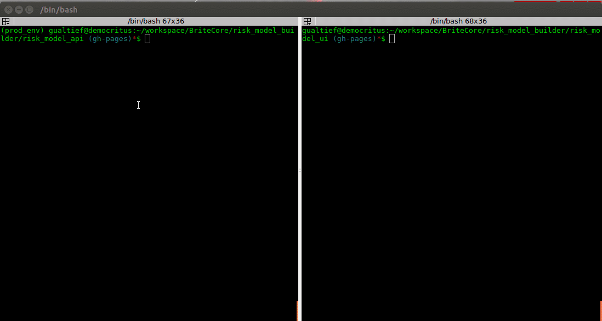
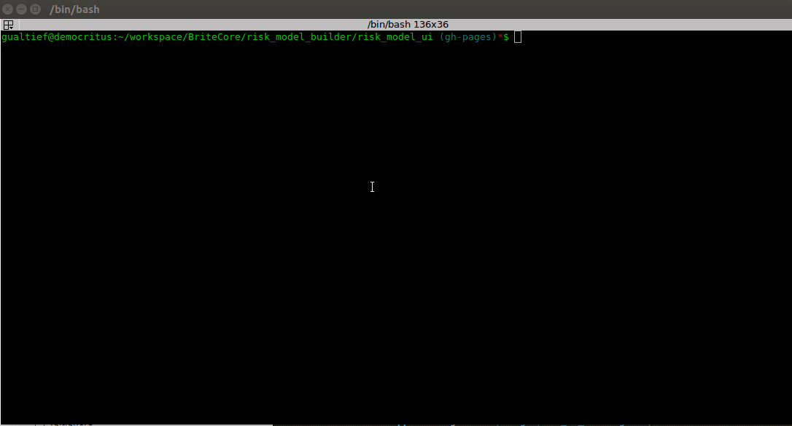

# Risk Model UI

## Table of Contents

<!-- MarkdownTOC -->

- Overview
- Demo the App
- Running Tests
- Running the App
- Building the App
- Developer's Guide
    - Setting Up Vue CLI
    - Creating a Project
    - Bootstrap
    - jQuery
    - Karma

<!-- /MarkdownTOC -->

## Overview

This is a single page web application developed with [Vue.js](https://vuejs.org) and [Webapack](https://webpack.js.org/) with the purpose of showing my front-end development skills.

The app retrieves risk types (or more precisely their definitions, i.e., name, description and fields) from the back-end service and builds a form with inputs corrresponding to each of the risk type's fields. In a nutshell, the forms in the UI are built dynamically according with the definitions retrieved from the API. For more details on the API take a look [here](../risk_model_api/README.md).

The UI consists of a main page that simply lists all of the available risk types and a detail page for each. By clicking on a specific risk type, the user navigates to a detail page that shows the risk type's corresponding application form.

<kbd></kbd>

## Demo the App

The UI has been deployed to GitHub Pages [here](https://marciogualtieri.github.io/risk_model_builder/risk_model_ui/demo/). Give it a try!

## Running Tests

<kbd></kbd>

To run [Jasmine tests](https://jasmine.github.io/):

    npm run test

Jasmine specs are available at [test/unit/specs](test/unit/specs).

The command above should output something similar to the following in the terminal:

    > risk_model_ui@1.0.0 test /home/gualtief/workspace/BriteCore/risk_model_builder/risk_model_ui
    > karma start test/unit/karma.conf.js --single-run

    11 12 2017 21:00:16.837:INFO [karma]: Karma v1.7.1 server started at http://0.0.0.0:9876/
    11 12 2017 21:00:16.840:INFO [launcher]: Launching browser Chrome with unlimited concurrency
    11 12 2017 21:00:16.848:INFO [launcher]: Starting browser Chrome
    11 12 2017 21:00:18.708:INFO [Chrome 61.0.3163 (Linux 0.0.0)]: Connected on socket Rmgijd2P37RuwNsbAAAA with id 50736339

      FieldForm.vue
        ✓ should render a field form

      FieldInput.vue
        ✓ should render a text field input
        ✓ should render a numeric field input
        ✓ should render a date field input
        ✓ should render a enum field input

      RiskItem.vue
        ✓ should render a risk item

      RiskList.vue
        ✓ should render a risk list

    Chrome 61.0.3163 (Linux 0.0.0): Executed 7 of 7 SUCCESS (0.114 secs / 0.081 secs)
    TOTAL: 7 SUCCESS

    =============================== Coverage summary ===============================
    Statements   : 90.82% ( 267/294 )
    Branches     : 50% ( 8/16 )
    Functions    : 90.77% ( 236/260 )
    Lines        : 90.75% ( 265/292 )
    ================================================================================

Note that we haven't reached 100% coverage (because of the router code), but I don't think that's an issue, given that every single component is being tested.

## Running the App

To install all dependencies:

    npm install

To run the UI with hot reload locally:

    npm run dev

## Building the App

To build for production with minification:

    npm run build

## Developer's Guide

For my own future reference, I'm going to document the entire process of creating an UI with Vue.js/Webpack.

### Setting Up Vue CLI

To install [nodejs](https://nodejs.org/en/) (at least version 6 is required):

    curl -sL https://deb.nodesource.com/setup_6.x | sudo -E bash -
    sudo apt-get install nodejs

To install [vue-cli](https://github.com/vuejs/vue-cli) (necessary to create the project's skeleton):

    sudo npm install -g vue-cli

### Creating a Project

Run the following command to create a project skeleton using the simple [webpack](https://webpack.js.org/) template:

    vue init webpack-simple risk_model_ui

### Bootstrap

To install [bootstrap-webpack](https://github.com/gowravshekar/bootstrap-webpack):

     npm i bootstrap-vue bootstrap@4.0.0-beta.2

Add the following imports to `main.js`:

    import BootstrapVue from 'bootstrap-vue'
    import 'bootstrap/dist/css/bootstrap.css'
    import 'bootstrap-vue/dist/bootstrap-vue.css'

    Vue.use(BootstrapVue);

### jQuery

The easiest way is to use [unpkg](https://unpkg.com/#/). Just add the following to your index.html:

    

But the recommended way is adding the following code to `main.js` (for consistency sake):

    import jQuery from 'jquery';

    window.jQuery = jQuery;
    window.$ = jQuery;

    Vue.use(BootstrapVue);
    Vue.use(VueRouter);

### Karma

#### Dependencies

To install [karma-webpack](https://github.com/webpack-contrib/karma-webpack)

    npm install -D karma-webpack

Which itself has the following dependencies:

    npm install karma-chrome-launcher --save-dev
    npm install karma-mocha --save-dev
    npm install karma-sinon-chai --save-dev
    npm install karma-sourcemap-loader --save-dev
    npm install karma-spec-reporter --save-dev
    npm install karma-coverage --save-dev
    npm install chai --save-dev
    npm install sinon --save-dev
    npm install sinon-chai --save-dev
    npm install istanbul --save-dev

#### Configuration

The file [test/unit/karma.conf.js](test/unit/karma.conf.js) needs to be created specifically for the purpose of running tests and coverage with Karma.
[package.json](package.json) also needs to be edited to include a call to Karma on tests.
